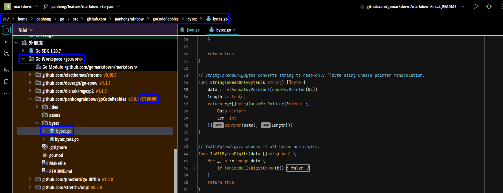

# goCodePebblez

This program is used to collect common snippets of code that are frequently modified, so I need to start `Go work environment`.

When starting the Go work environment, since this project has already set up `Go module`, there should be no errors.

Below are the steps to start the Go work environment in other projects

```bash
$ cd /home/panhong/go/src/github.com/panhongrainbow/My_Project # Enter the project folder

$ ls go.mod # Verify if there is a Go module

$ go work init # Initialize

$ go work use . # Use the current Go module

$ go work edit -replace=github.com/panhongrainbow/goCodePebblez=/home/panhong/go/src/github.com/panhongrainbow/goCodePebblez # replace the library to the local directory
```

By following these steps, I can proceed to `make modifications to the contents of goCodePebblez`.

However, in the end, I will need to upload the modified code of goCodePebblez.

 

